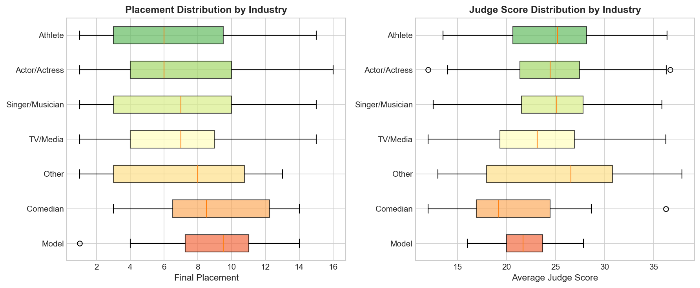

# Task 3 Extended: Industry Descriptive Analysis

*Generated: 2026-02-03 06:48*

---

## Overview

本节对选手的职业/行业背景进行**描述性分析**，探索不同行业选手在DWTS中的表现差异。

> **注意**：Industry变量未纳入主回归模型，以保持模型简洁性。本节仅提供描述性统计和可视化。

## 1. Industry Distribution

### 1.1 Original Categories

| Industry | Count |
|----------|-------|
| Actor/Actress | 128 |
| Athlete | 95 |
| TV Personality | 67 |
| Singer/Rapper | 61 |
| Model | 17 |
| Comedian | 12 |
| Social Media Personality | 8 |
| Entrepreneur | 4 |
| Radio Personality | 4 |
| Racing Driver | 4 |
| Politician | 3 |
| News Anchor | 3 |

### 1.2 Simplified Categories

We consolidated the original categories into 7 groups for clearer analysis:

| Group | Includes | N |
|-------|----------|---|
| Actor/Actress | Actor/Actress | 128 |
| Athlete | Athlete, Racing Driver | 99 |
| TV/Media | TV Personality, News Anchor, Broadcaster | 76 |
| Singer/Musician | Singer/Rapper, Musician | 62 |
| Model | Model, Beauty Pageant | 18 |
| Comedian | Comedian | 12 |
| Other | Socialite, Entrepreneur, etc. | 26 |

## 2. Performance by Industry

### 2.1 Summary Statistics

| Industry | N | Avg Placement | Best | Avg Judge | Avg Fan Vote | Winners | Win Rate |
|----------|---|---------------|------|-----------|--------------|---------|----------|
| Athlete | 99 | 6.21 | 1 | 24.7 | 0.114 | 12 | 12.1% |
| Actor/Actress | 128 | 6.75 | 1 | 24.5 | 0.107 | 8 | 6.2% |
| Singer/Musician | 62 | 6.81 | 1 | 24.4 | 0.112 | 4 | 6.5% |
| TV/Media | 76 | 6.82 | 1 | 23.4 | 0.102 | 7 | 9.2% |
| Other | 26 | 7.08 | 1 | 25.2 | 0.098 | 2 | 7.7% |
| Comedian | 12 | 8.75 | 3 | 21.0 | 0.072 | 0 | 0.0% |
| Model | 18 | 8.94 | 1 | 21.8 | 0.092 | 1 | 5.6% |

### 2.2 Key Observations

1. **Best Average Placement**: Athlete (avg rank: 6.21)
2. **Worst Average Placement**: Model (avg rank: 8.94)
3. **Most Winners**: Athlete (12 wins)
4. **Highest Judge Scores**: Other (avg: 25.2)
5. **Highest Fan Vote Share**: Athlete (avg: 0.114)

## 3. Visualizations

### Figure: Industry Effect Comparison

### Figure: Industry Distribution (Boxplot)

## 4. Discussion

### Why Not Include Industry in the Regression Model?

1. **Parsimony**: Including 6+ dummy variables would reduce model interpretability.
2. **Collinearity Concerns**: Industry may correlate with age and popularity.
3. **Sample Size**: Some categories (e.g., Comedian) have limited observations.
4. **Focus**: The main model emphasizes universal factors (age, popularity, partner effects).

### Interpretation Notes

- **Athletes** often perform well, possibly due to physical conditioning and competitive mindset.
- **Actors/Actresses** show strong performance, potentially from stage experience and camera comfort.
- **Singers/Musicians** may have inherent rhythm advantages but mixed results overall.
- Industry effects are **confounded** with other factors and should not be interpreted causally.

---

*This analysis is supplementary to the main regression results in Task 3.*